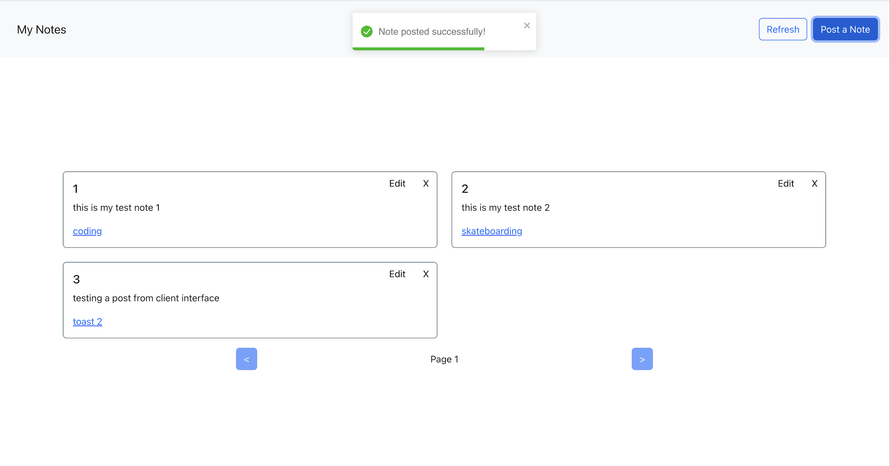

# Quick Notes App - EA

This is a full stack application for jotting down quick notes.

The REST API is built using Node.js/Express and the client-side with React. Follow the simple steps below to get up and running.



<br/>

## Usage

### Install Dependencies

Install the dependencies required for the project. The client folder contains the dependencies for the front-end.

```bash
npm install
cd client
npm install
cd ..
```

### Environment Variables

Create an env file and specify the database. 

```
echo 'PGDATABASE=quick_notes' > ./.env
```
Ensure the env file is created in the root folder quicknotes and not in the client folder.

### Seeding

Populate the database using

```bash
npm run setup-dbs
```

### Back-end/Express Server

```bash
npm start
```

The API can be accessed at `http://localhost:9090`

<br/>

### Front-end/React

Open a new terminal to open the front-end application server alongside the back-end.

```bash
cd client
npm run dev
```

Visit `http://localhost:3000`

<br/>

## REST Endpoints

### Ideas

| Endpoint       | Description    | Method | Body                |
| -------------- | -------------- | ------ | ------------------- |
| /api/notes     | Get all Notes  | GET    | None                |
| /api/notes/:id | Get note by id | GET    | None                |
| /api/notes     | Add note       | POST   | { note, date, tag } |
| /api/notes/:id | Update note    | PUT    | { note, date, tag } |
| /api/notes/:id | Delete note    | DELETE | None                |
